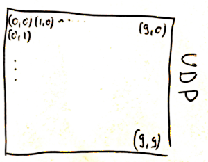

Noisebridge Flaschen Taschen Project
====================================


Software for [FlaschenTaschen]. Inspired by [MateLight].

Current hardware setup on the Raspberry Pi (should work on Pi-1 or Pi-2).

 * Top Display: *WS2811* strip to GPIO 18 (pin 12)
 * Bottom Display: *LPD6803* strip: clk on GPIO 17 (pin 11); data on GPIO 11 (pin 23)

## Build Instructions

Note: This project uses a git submodule for controlling ws28xx from the Raspberry Pi software by [jgarf](https://github.com/jgarff/rpi_ws281x)

```bash
$ git clone --recursive https://github.com/hzeller/flaschen-taschen.git
$ cd flaschen-taschen
$ make -C server
$ sudo ./server/ft-server   # runs as daemon on a Raspberry Pi.
# Clients to send content to the display can be found in the client/ dir
$ sudo aptitude install libmagick++-dev
$ make -C client
```

If you are reading this after cloning and forget to clone recursively, you can just run the following git command to update the submodule:

```
$ git submodule update --init
```

## Operating Instructions

The Flaschen-Taschen server `ft-server` becomes a daemon (also it drops
privileges to daemon:daemon). Kill the hard way with `sudo killall ft-server`

## Getting Pixels on Flaschen Taschen

To make it simple to illuminate the matrix, there are _three_ protocols that
are all supported:

 * Receives UDP packet on port 1337 interpreted as framebuffer (RGBRGB...)
   (Simulated layout standard left-right, top-bottom framebuffer expected). Easy
   way to get such raw picture is to edit out the header out of *.ppm file.



 * Runs http://openpixelcontrol.org/ server on standard port 7890
   (Simulated layout row 0: left-right, row 1: right-left, row 2: left-right...;
   this is what their standard `wall.py` script assumes).


 * Provides pixel pusher control via standard beacon (this is cool to be used
   together with processing, there are libs that support it).
   (Simulated layout: 10 strips starting on the left with 10 pixels each;
   pretty much like a standard framebuffer).


Within noisebridge, the hostname is `flaschen-taschen.local`.

So, for instance you can send a raw image to the service like this; each pixel
represented by a red/green/blue byte.

```
cat raw-image.bytes | socat STDIO UDP-SENDTO:flaschen-taschen.local:1337
```

Or, if you are using bash, it is even simpler
```
cat raw-image.bytes > /dev/udp/flaschen-taschen.local/1337
```

The current display is 10x10 pixels, so it would be 3 * 100 bytes.

You find more in the [client/ directory](./client) to directly send
content to the server.

[FlaschenTaschen]: https://noisebridge.net/wiki/Flaschen_Taschen
[MateLight]: https://github.com/jaseg/matelight
