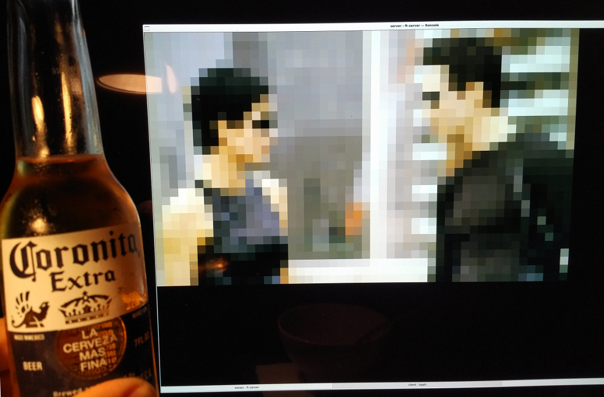

Flaschen Taschen Clients
========================

Useful utilities to send content to the FlaschenTaschen installation.

This directory provides:
  * `send-text` binary, that prints a static or scrolling text.
  * `send-image` binary, that reads an arbitrary image (including
    animated *.gifs), scales it and sends to FlaschenTaschen.
  * `send-video` binary, that reads an arbitrary video, scales it and
    sends to FlaschenTaschen.

### Network destination

The clients connect to the display over the network. The
default hostname is pointing to the installation within Noisebridge
(currently `ft.noise`).

You can change that with commandline flags (e.g. `send-text`, `send-image`,
and `send-video` all have a `-h <host>` option) or via the environment
variable `FT_DISPLAY`.

So if you are working with a particular instance of FlaschenTaschen (e.g.
a [local terminal](../server/README.md#terminal)), just set the environment
variable for ease of playing.

```
export FT_DISPLAY=localhost
```

## Send-Text

### Compile
```bash
make
```

### Use
```
usage: ./send-text [options] <TEXT>
Options:
        -g <width>x<height>[+<off_x>+<off_y>[+<layer>]] : Output geometry. Default 45x<font-height>+0+0+1
        -l <layer>      : Layer 0..15. Default 1 (note if also given in -g, then last counts)
        -h <host>       : Flaschen-Taschen display hostname.
        -f <fontfile>   : Path to *.bdf font file
        -s<ms>          : Scroll milliseconds per pixel (default 60). 0 for no-scroll.
        -O              : Only run once, don't scroll forever.
        -S<px>          : Letter spacing in pixels (default: 0)
        -c<RRGGBB>      : Text color as hex (default: FFFFFF)
        -b<RRGGBB>      : Background color as hex (default: 000000)
        -o<RRGGBB>      : Outline color as hex (default: no outline)
        -v              : Scroll text vertically
```

Sample
```bash
./send-text -f fonts/6x10.bdf "We ♥ Flaschen Taschen"

# Or coordinated horizontal and vertical messages
./send-text -h localhost "♥Flaschen" -f fonts/5x5.bdf -s 60 -g 45x35+0+15+3 & ./send-text -h localhost "Taschen " -f fonts/5x5.bdf  -v  -s 60 -g 45x35+20+0+2 && fg

# Or, how about showing the time
while : ; do sleep 1 ; ./send-text -f fonts/9x18.bdf -s0 `date +%H:%M` ; done
```

Text has a default layer of 1, so it is hovering above the background image.
If you don't want that, you can explicitly set it as last value in the geometry
specification.

If you add a `-o` color, then the font gets an outline of that given color,
which you can use to create a contrast for the font.
## Send-Image

### Compile
```bash
# Need some devel libs
sudo apt-get install libgraphicsmagick++-dev libwebp-dev
make send-image
```

### Use
```
usage: ./send-image [options] <image>
Options:
        -g <width>x<height>[+<off_x>+<off_y>[+<layer>]] : Output geometry. Default 20x20+0+0+0
        -l <layer>      : Layer 0..15. Default 0 (note if also given in -g, then last counts)
        -h <host>       : Flaschen-Taschen display hostname.
        -s[<ms>]        : Scroll horizontally (optionally: delay ms; default 60).
        -C              : Just clear given area and exit.
```

Essentially just send the FlaschenTaschen display an image over the network:

```
./send-image -g10x20+15+7 some-image.png
```

Image will be scaled to the given size (here 10x20) and shown
on the FlaschenTaschen display at the given offset (here 15 pixels x-offset,
7 pixels y-offset).

The program exits as soon as the image is sent unless it is an animated gif in
which case `send-image` keeps streaming until interrupted with `Ctrl-C`.

If you want to scroll a long image accross the display, use the `-s` option. In
this case, only the height is scaled to the display height and the image is
scrolled infinitely over width.

Let's try this with an example image:

```
./send-image -s ../img/flaschen-taschen-black.ppm
```

## Send-Video

### Compile
```bash
# Need some devel libs
sudo apt-get install libavcodec-dev libavformat-dev libswscale-dev
make send-video
```

### Use
```
usage: ./send-video [options] <video>
Options:
        -g <width>x<height>[+<off_x>+<off_y>[+<layer>]] : Output geometry. Default 20x20+0+0
        -h <host>          : Flaschen-Taschen display hostname.
        -l <layer>         : Layer 0..15. Default 0 (note if also given in -g, then last counts)
        -v                 : verbose.
```


